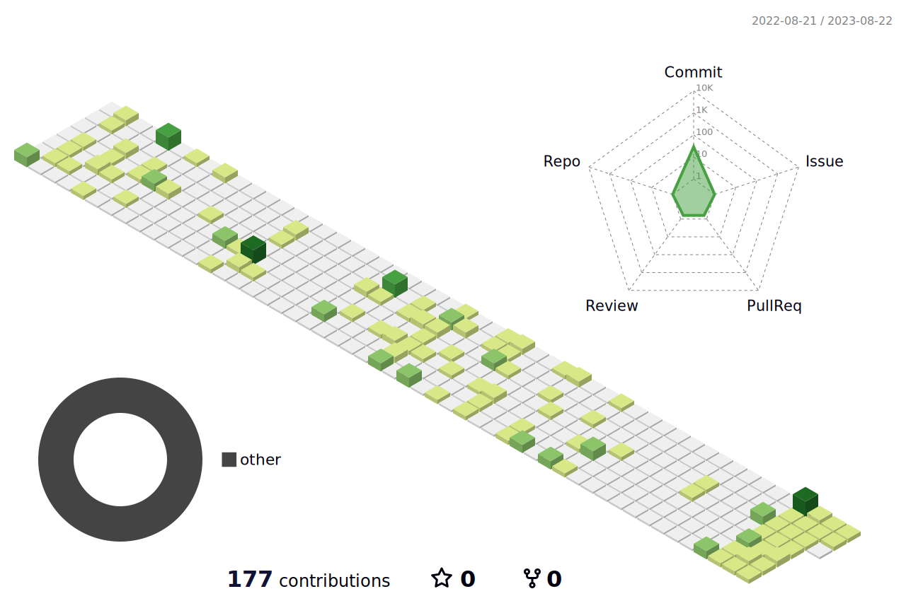

<!--
This repository is largely based on:
https://github.com/BEPb/BEPb
-->

<!-- my-icons -->
<!-- 

    
    
    
    
    
       

 -->

<!-- my-header-img -->

<!-- my-ticker -->  

<!-- my-skils -->
| Skills                                          | Details                                                                                                                                                                                                                                                                                                                                                                                                                                                                                                                                                                                                                              |
|-------------------------------------------------|--------------------------------------------------------------------------------------------------------------------------------------------------------------------------------------------------------------------------------------------------------------------------------------------------------------------------------------------------------------------------------------------------------------------------------------------------------------------------------------------------------------------------------------------------------------------------------------------------------------------------------------|
| **Programming Language**                        |                                                                                                                                                                                                                                         |
| **Domain Knowledge**                            |                                                                                                                                                                                                                                        |
| **Operating System**                            |                                                                                                                                                                                                                                                                                                                              |
| **Deep Learning frameworks**                    |                                                                                                                                                                                                                   |
| **Packages**                                    |       |

<!-- profile-green-animate -->
<!--  -->

<!-- visitor-counting -->

